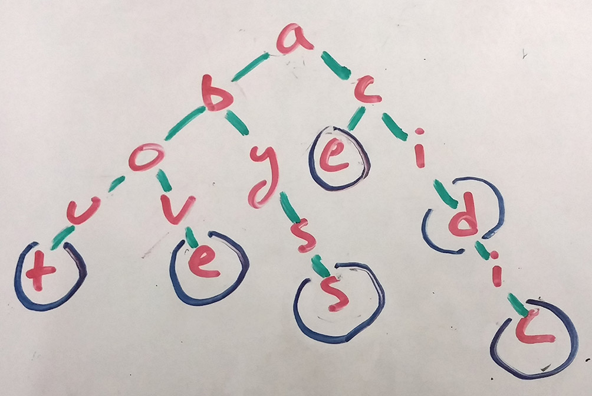

If you ever had a flip phone, you probably used T9 to compose text messages. T9 let you enter words with a single tap on each number key, instead of selecting each letter with multiple presses (otherwise to get 'c', you'd need to hit '2' three times). It looked at all possible word-pieces that a combination of key presses could create, and then it suggested words to the user based on those pieces.

Say a user has entered 2-2-3 on the keypad. The letters corresponding to the '2' key are [a,b,c], and the letters for '3' are [d,e,f]. To give a relevant prediction, the algorithm needs to consider each possible word that could be created with these letters, like this:

    [a,b,c]
    [a,b,c]
    [d,e,f]
    (sorry, image coming. imagine arrows connecting every letter on one row to every letter on the row below it.)

The arrows represent choices, or paths the algorithm could follow from the letters of first row. You can see how it might select the words 'Abe', 'Ace', and 'Bad'. A good algorithm should also suggest words with more than 3 characters that start with paths from the current input, like 'Abduct'.

A naive algorithm would try to generate all of the strings that could follow from the input digits, then filter them based on a dictionary. The code to generate the possibilities looks like this:

While this approach would work, it's easy to see that a lot of extra work is performed, especially once it starts looking at a dictionary to filter real words from random strings.

A *trie*, or prefix tree, is a data structure especially well-suited to the problem. In a trie, the value represented by a particular node is decided by the path taken to reach that node. Each node in turn might represent a bit of the value of another node, as a part of that other node's *prefix*.

Say a list of words was inserted into a trie. Some nodes would represent full words, some only letters in the middle of other words. And the nodes that do represent full words need not store the actual word. Word-ending nodes are flagged as such, and all of the nodes (and their letters) that precede a flagged node combine to build the word.

An algorithm looking for words with the common prefix 'Abo' would simply move down each branch below the 'o' node, recording the full path when it finds another flagged node. Here, it would find 'About' and 'Above'.

This method of inserting words would work for T9, and I did in fact implement a [successful system using it](https://github.com/olslash/T9/tree/master/first_attempt). For this post, however, I'm going to show a different method of building the prefix tree, which is more aware of the rules of the problem.

First, a path through the tree will represent a sequence of key presses: numbers, not letters. Second, at each node, we will store an array containing the words possible from those numbers (a linked list would also work, but an array is simpler).

This algorithm is better for several reasons. First, in the spirit of the problem (use on a flip-phone), it requires very little work on the part of the device. The most computationally intensive effort is done when a word is inserted into the tree, where responsiveness is of little importance (the tree would come pre-populated with the software). Second, this method allows words to be predicted in any order we want, based on the word's position in the list. In this case, ordering words by their frequency of use in English gives the most relevant results. Third, the actual algorithm is simpler and easier to write, because we don't have to traverse the tree for every possible combination of letters – we go down a single path to get relevant results, and if more are wanted, a depth-first search from the end of the first path gives relevant results.
####Implementation####
First, we create an object that corresponds the letters in the alphabet to the keys on the phone's number pad.

A Trie class forms the basis for the construction of a tree. Each node in the tree is an instance of Trie. The class holds the methods for insertion of words and retrieval of suggestions, and each node stores its own children and any words associated with its position in the tree. 

The words themselves are stored inside the words arrays as tuples, with the first element being the word, and the second the frequency of use of that word in English.

The first of the two methods on Trie's prototype is `insert()`. Below, we create the skeleton for the insert method, for now leaving out the details of the two helper functions that define how the actual insertion will be implemented.

First, the algorithm creates the nodes required to form the chain of numbers used to type the word. Once it reaches the node where the word should be stored, it inserts the word into that node's word list.

The `traverseAddingNodes()` function returns the node where the word we're inserting should go, creating nodes as needed. It first moves down any existing partial path of nodes in the tree, then it creates the nodes that are needed to complete the path.

`insertWordIntoListByFrequency()` is the insert method's second helper function. Its job is to insert a word into the words list stored on a node, ordering it with respect to any existing entries in descending order by frequency score.

`getSuggestions()` is the other method on Trie's prototype. It is called by the client to actually retrieve recommendations based on a string of input numbers. It starts by descending through the tree, following the path defined by `keyString`, the sequence of keypad numbers the user has entered. It then returns all words stored at the end of that path. Additionally, it will descend through all paths below that node to find suggestions with more letters than the number of keys in the key string (using the stubbed-out `getDeeperSuggestions` function.

`getDeeperSuggestions`, then is what does the work of getting results beyond the current key sequence. The `suggestionDepth` variable controls how many levels to descend, in case performance becomes an issue with very large trees.

If you're reading this, I haven't had time to put up the demo site with a usable implementation. The code is all online at https://github.com/olslash/t9, including a frontend and unit tests.
